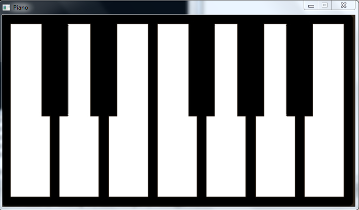

# Allegro 5 Projects
Required libraries:
- Allegro 5

***1. Digital piano made with C and the library Allegro5. At the moment, only work with the mouse click.***

**Preview:**

**2. Tic Tac Toe. Made with C and the library Allegro5.**
**Preview:**

